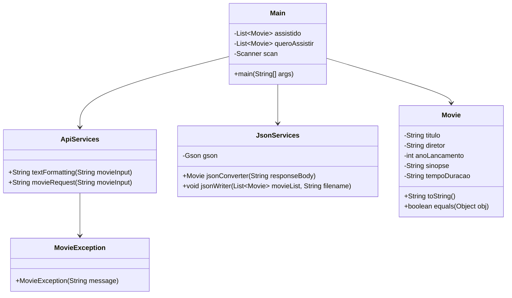

# Movie Library

Movie Library é uma aplicação em Java que permite pesquisar filmes através da [API OMDB](https://www.omdbapi.com/), organizá-los em listas como "Assistidos" e "Quero Assistir", e salvar essas listas em arquivos JSON. É uma ferramenta simples e prática para manter sua biblioteca de filmes atualizada.

## Funcionalidades

- Busque informações detalhadas de filmes diretamente da API OMDB(titulo, diretor, ano de lançamento, etc).
- Organize filmes em listas — "Assistidos" ou "Quero Assistir".
- Salve suas listas para arquivos JSON para armazenamento local.
- Limpar as listas de filmes "Assistidos" ou "Quero Assistir".
- Controle de erros para entradas inválidas, manuseio de exceções durante requisições API e escrita de arquivos.

## Tecnologias Utilizadas

- **Java**: Linguagem de programação.
- **HttpClient**: Para realizar requisições HTTP à API OMDB.
- **Gson**: Biblioteca para converter JSON para objetos Java e vice-versa.
- **OMDB API**: API utilizada obter informações de um filme.

## Requisitos

- **Java 11** ou superior.
- Biblioteca `Gson` (o JAR está incluído na pasta `Dependencies`).

## Diagrama de Classes



## Como Executar o Projeto

1. **Clone o repositório:**
   ```bash
   git clone https://github.com/pabloviniciustbbt/MovieLibrary.git
   ```
2. **Entre no diretório do projeto via prompt de comando e execute a compilação:**
   ```bash
   javac -cp ".;Dependencies/gson-2.11.0.jar" -d bin @sources.txt
   ````
3. **Execute o Projeto:**
   ```bash
   java -cp ".;bin;Dependencies/gson-2.11.0.jar" com.pabloleal.movielibrary.Main
   ```
   ## Exemplo de Saída:

   ```bash
    =================================
              Movie Library
    =================================

    Escolha uma das opcoes abaixo:

    1. Pesquisar Filme
    2. Salvar lista em Json
    3. Limpar listas
    0. Sair

    Digite aqui: 1

    Digite o nome de um filme: Mad Max

    Titulo: Mad Max
    Diretor: George Miller
    Ano de Lancamento: 1979
    Sinopse: In a self-destructing world, a vengeful Australian policeman sets out to stop a violent motorcycle gang.
    Tempo de Duracao: 88 min

    1. Adicionar filme a lista Assistidos
    2. Adicionar filme a lista Quero Assistir
    0. Voltar ao Menu Principal

    Digite Aqui: 1

    ==============================================
        Filme Adicionado a Lista Assistidos
    ==============================================
    ```

## Contribuições:

Sinta-se à vontade para contribuir com o projeto! Se você tem sugestões de melhorias, correções de bugs ou novas funcionalidades, abra um Pull Request e ajude a tornar o MovieLibrary ainda melhor.

Divirta-se explorando o MovieLibrary e descobrindo novas informações sobre filmes!📽